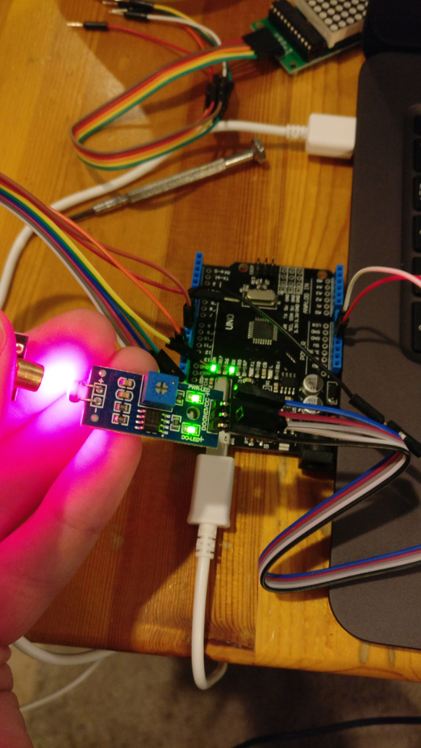

# Digital Scoreboard

This code powers a score counter for a custom made foosball table.
It runs on an Arduino Uno with 2 led matrix displays, 2 photo resistors, 2 laser diodes, and a piezo buzzer.
As the balls interrupt the laser, it will keep track of each players score and display them on the matrix display.
Once the score reaches 10, the game is over and a melody is played on the buzzer.

